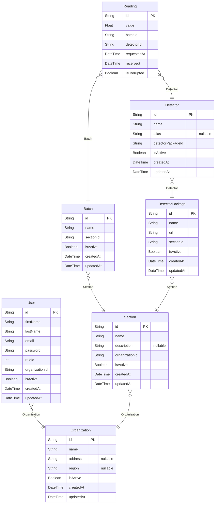

```mermaid
erDiagram

  User {
    String id PK 
    String firstName  
    String lastName  
    String email  
    String password  
    Int roleId  
    String organizationId  
    Boolean isActive  
    DateTime createdAt  
    DateTime updatedAt  
    }
  

  Organization {
    String id PK 
    String name  
    String address  "nullable"
    String region  "nullable"
    Boolean isActive  
    DateTime createdAt  
    DateTime updatedAt  
    }
  

  Section {
    String id PK 
    String name  
    String description  "nullable"
    String organizationId  
    Boolean isActive  
    DateTime createdAt  
    DateTime updatedAt  
    }
  

  Batch {
    String id PK 
    String name  
    String sectionId  
    Boolean isActive  
    DateTime createdAt  
    DateTime updatedAt  
    }
  

  Detector {
    String id PK 
    String name  
    String alias  "nullable"
    String detectorPackageId  
    Boolean isActive  
    DateTime createdAt  
    DateTime updatedAt  
    }
  

  DetectorPackage {
    String id PK 
    String name  
    String url  
    String sectionId  
    Boolean isActive  
    DateTime createdAt  
    DateTime updatedAt  
    }
  

  Reading {
    String id PK 
    Float value  
    String batchId  
    String detectorId  
    DateTime requestedAt  
    DateTime receivedt  
    Boolean isCorrupted  
    }
  
    User o{--|| Organization : "Organization"
    Section o{--|| Organization : "Organization"
    Batch o{--|| Section : "Section"
    Detector o{--|| DetectorPackage : "Detector"
    DetectorPackage o{--|| Section : "Section"
    Reading o{--|| Batch : "Batch"
    Reading o{--|| Detector : "Detector"
```
